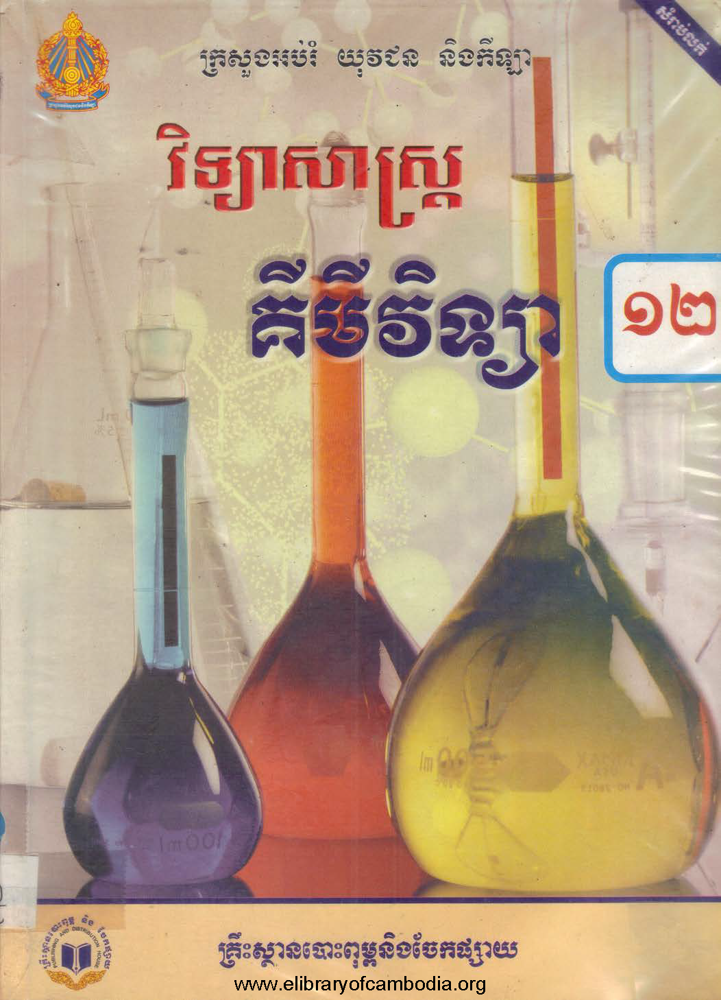

# <!--fit--> EQUILIBRIUM OF ACID, BASE AND SALT

---
# លំនឹង (Equilibrium)

តើអ្វីទៅគឺជាលំនឹង?

* ជាទូទៅ លំនឹងគឺជា ភាព​នឹង, ការ​ឋិត​នៅ​នឹង, មិនប្រែប្រួល, $\frac{dy}{dx} = 0$

---
# លំនឹងនៅក្នុ្ងងគីមីវិទ្យា

គីមីវិទ្យាគឺជាអ្វី?
* យើងមើល[វីដេអូបកស្រាយបន្ថែម](https://www.youtube.com/watch?v=NDPad7BIQpU)
* គីមីវិទ្យាគឺជាការសិក្សាអំពីភាគល្អិត ឬក៏ការសិក្សាអំពីការប្រែប្រួល
* ដូចនេះលំនឹងនៅក្នុងគីមីវិទ្យាសិក្សាអំពីភាពនឹងក្រោយការប្រែប្រួលនៃភាគល្អិត

---
# ប្រតិកម្មគីមីនិងអុីយ៉ុង

តើប្រតិកម្មគីមីសំដៅទៅអ្វី? តើអុីយ៉ុងជាអ្វី?
* ប្រតិកម្មគីមីគឺលំនាំនៃការប្រែប្រួលនៃភាគល្អិត
* អុីយ៉ុងជាអាតូមដែលមានបន្ទុក

--- 

# ប្រតិកម្មអុីយ៉ុងកម្ម 
អង្គធាតុខ្លះរលាយក្នុងទឹកដើម្បីបង្កើតបានជាអុីយ៉ុង។ លំនាំនេះគេហៅថាប្រតិកម្មអុីយ៉ុងកម្ម។

---

# អុីយ៉ុងកម្មអាសុីត

* អាសុីតមានតួនាទីបញ្ចេញប្រូតុង។
* ដើម្បីសរសេរសមីការទូទៅ គេតាង $\ce{HA}$ ជាអាសុីតណាមួយ
* $\ce{HA(aq) + H2O(l) <=> A-(aq) + H3O+(aq)}$

---

# អុីយ៉ុងកម្មបាស

* បាសមានតួនាទីចាប់យកប្រូតុង។
* ដើម្បីសរសេរសមីការទូទៅ គេតាង $\ce{B}$ ជាបាសណាមួយ
* $\ce{B(aq) + H2O(l) <=> HB+(aq) + OH-(aq)}$

---

# ប្រតិកម្មសព្វនិងមិនសព្វ

តើពាក្យ **"សព្វ"** មានន័យដូចម្ដេច? តើពាក្យនេះមានអត្ថន័យយ៉ាងដូចម្ដេចក្នុងប្រតិកម្មគីមី?
* **សព្វ**មានន័យថា ទាំងអស់, ទាំងមូល, ទាំងស្រុង, ទាំង​គ្រប់
* ប្រតិកម្មសព្វកើតឡើងពេលភាគល្អិត(អង្គធាតុប្រតិករ) ផ្លាស់ប្តូរទាំងស្រុងពេលវាមាន**លំនឹង**។

---

# អាសុីត បាស "ខ្លាំង" និង "ខ្សោយ"

គេរលាយអាសុីតនិងបាសក្នុងទឹក។
តាមការបកស្រាយខាងលើនិងតាមវិចារណញ្ញាណអ្នក ចូរបំពេញតារាងនេះ

| ប្រភេទគីមី  | ប្រតិកម្ម(សព្វឬមិនសព្វ)  | សល់អង្គធាតុប្រតិករ?| អង្គធាតុប្រតិករ = អង្គធាតុកកើត?|
|---|---|---|---|
|អាសុីតខ្លាំង|||
|អាសុីតខ្សោយ|||
|បាសខ្លាំង|||
|បាសខ្សោយ|||

---

## ចម្លើយ

| ប្រភេទគីមី  | សព្វ?  | អង្គធាតុប្រតិករសល់?| អង្គធាតុប្រតិករ = អង្គធាតុកកើតពេលលំនឹង?|
|---|---|---|---|
|អាសុីតខ្លាំង|សព្វ|អត់សល់| yes
|អាសុីតខ្សោយ|មិនសព្វ|សល់| no
|បាសខ្លាំង|សព្វ|អត់សល់| yes 
|បាសខ្សោយ|មិនសព្វ|សល់| no

--- 

# ថេរលំនឹងអាសុីត និង ថេរលំនឹងបាស

តើគេវាស់កម្រឹត"ខ្លាំង" ឬ "ខ្សោយ" និងអាសុីត បាសតាមណា?

--- 

# ថេរលំនឹងអាសុីត និង ថេរលំនឹងបាស

តើគេវាស់កម្រឹត"ខ្លាំង" ឬ "ខ្សោយ" និងអាសុីត បាសតាមណា?

1. គេពិសោធន៍

--- 

# ថេរលំនឹងអាសុីត និង ថេរលំនឹងបាស

តើគេវាស់កម្រឹត"ខ្លាំង" ឬ "ខ្សោយ" និងអាសុីត បាសតាមណា?

1. គេពិសោធន៍
2. គេកំណត់ថេរលំនឹងមួយគេតាង $K_a$ ចំពោះអាសុីត និង $K_b$ ចំពេាះបាស

---
## ចំពេាះអាសុីត $K_a$
* សមីការលំនឹង ៖ $\ce{HA(aq) + H2O(l) <=> A-(aq) + H3O+(aq)}$
* ដើម្បីទទួលបាន $K_a$ គេយកផលគុណនៃកំហាប់អង្គធាតុកកើតចែកនឹងផលគុណនៃកំហាប់អង្គធាតុប្រតិករនៃពេលលំនឹង។
* $K_a = \frac{\ce{[A-] \times [H3O+]}}{\ce{[HA]}}$

--- 

## ចំពេាះបាស $K_b$
* សមីការលំនឹង ៖ $\ce{B(aq) + H2O(l) <=> HB+(aq) + OH-(aq)}$
* $K_b$ = 

---
# លំហាត់ពង្រឹងពុទ្ធិ
គេឲ្យ៖ $K_a = \frac{\ce{[A-] \times [H3O+]}}{\ce{[HA]}}$ និង $K_b = \frac{\ce{[HB+] \times [OH-]}}{\ce{[B]}}$

| ប្រភេទគីមី  | ថេរលំនឹង ($K_a$ ឬ $K_b$) | តម្លៃ (ធំឬតូច) |
|---|---|---|
|អាសុីតខ្លាំង||
|អាសុីតខ្សោយ||
|បាសខ្លាំង||
|បាសខ្សោយ||

---

# រកភាគរយអុីយ៉ុងកម្ម $\alpha$

ភាគរយអុីយ៉ុងកម្ម $\alpha$ ជាទិន្នន័យមួយស្រួលមើលនិងស្រួលយល់ដល់គីមីវិទូ។ $\alpha$ បង្ហាញពីភាគរយនៃអាសុីតឬបាសដើមដែលបានបំបែកជាអុីយ៉ុង។ 
បើគេមានសមីការលំនឹង៖ 
$$
\ce{HA(aq) + H2O(l) <=> A-(aq) + H3O+(aq)}
$$
នេាះ
$$\alpha = \frac{\ce{[H3O+]} \times 100}{\ce{[HA]}}$$

---

# របៀបដោះស្រាយលំហាត់ថេរលំនឹងអាសុីតបាស
## Style Easy (អត់ចេញ BACII)

សូលុយស្យុងអាសុីតអាសេទិច $(\ce{CH3COOH})$ មួយមានកំហាប់ 2M។ $K_a = 1.8 \times 10^{-5}, \log 6 = 0.77$
1. សរសេរសមីការអុីយ៉ុងកម្មនៃអាសុីតអាសេទិច
2. គណនា pH នៃសូលុយស្យុងអាសុីត
3. គណនាភាគរយអុីយ៉ុងកម្ម

---
1. សរសេរសមីការអុីយ៉ុងកម្មនៃអាសុីតអាសេទិច
សមីការ៖ $\ce{CH3COOH(aq) + H2O(l) <=> CH3COO-(aq) + H3O+(aq)}$

## Note
* មើលទន្ន័យគេឲ្យ។ បើគេឲ្យ $K_a$ អង្គធាតុកកើតបាន $\ce{H3O+}$, $K_b$ អង្គធាតុកកើតបាន $\ce{OH-}$។
* ដោយសារ $\ce{CH3COOH}$ ខ្សោយ គេប្រើ $\ce{<=>}$ 

---
2. រក pH
$
\begin{flalign}
\text{ }&\ce{CH3COOH(aq)} + & \ce{H2O(l)}  \ce{<=>} &\ce{CH3COO-(aq)} & + &\ce{H3O+(aq)} & \quad \quad\quad\quad\quad \\
I:\ & 2& & 0& 0 &\\
C:\ & -x& &+x & + x&\\ 
E:\ &2 - x & & x & x&
\end{flalign}
$

## Note
* ដើម្បីភាពងាយស្រួលដល់អ្នកអាននិងអ្នកធ្វើ គេតែងតែប្រើតារាង Initial(I), Change(C) និង Equilibrium(E)
* ក្នុងប្រឡង I = កំហាប់ដើម, C = កំហាប់ប្រែប្រួល, E = កំហាប់លំនឹង។ 
* តាង $x$ ដោយសារប្រតិកម្មមិនសព្វ
* ខ្នាតគិតជា $M$ ឬ $mol/l$។ បើគេឲ្យជាម៉ូល យើងត្រូវរកកំហាប់មុន
* $\ce{H2O}$ មិនបាច់កត់ត្រា
---

តាមកន្សោមថេរលំនឹង $K_a = \frac{\ce{[H3O+] \times [CHCOO-]}}{\ce{[CH3COOH]}} = \frac{x \times x}{2 - x}$

ដោយតម្លៃ $K_a = 1.8 \times 10^{-5}$ តូចពេក នាំឲ្យ $x$ ក៏តូចណាស់ដែរ។ ដូច្នេះតម្លៃ $x$ នៅក្នុងកន្សោមអាចចោលបាន គេបាន $(2 - x) \approx 2$។

សមមូល $\frac{x \times x}{2} = 1.8 \times 10^{-5}$
សមមួល $x^2 = 36 \times 10^{-6}$
គេបាន $\ce{[H3O+]} = x = \sqrt{36 \times 10^{-6}} = \sqrt{36} \times \sqrt{10^{-6}} = 6 \times 10^{-3} M$

តាម $\text{pH} = -\log \ce{[H3O+]}$
ដោយ $\ce{[H3O+]} = 6 \times 10^{-3}M$
នាំឲ្យ $\text{pH} = - \log (6 \times 10^{-3}) = 3 - \log 6 = 3 - 0.77 = 2.23$
ដូចនេះសូលុយស្យុអាសុីត $\text{pH} = 2.23$

---

3. គណនាភាគរយអុីយ៉ុងកម្ម
តាមរូបមន្ត $\alpha = \frac{\ce{[H3O+]} \times 100}{\ce{[CH3COOH]}}$
ដោយ $\ce{[CH3COOH]} = 2M, \ce{[H3O+]} = 6 \times 10^{-3}M$
នាំឲ្យ $\alpha = \frac{6 \times 10^{-3} \times 100}{2} = 0.3 \%$

---

# តួនាទីនៃសូលុយស្យុងតំប៉ុង
សូលុយស្យុងតំប៉ុងមាន pH ថេរពេលគេបណ្ថែម អាសុីត (អុីយ៉ុង$\ce{H3O+}$)​ឬបាស (អុីយ៉ុង$\ce{OH-}$)។ 

---

# ការបង្កើតសូលុយស្យុងតំប៉ុង

ពេលគេថែម $\ce{H3O+}$ គេត្រូវមានបាសប្រតិកម្មដើម្បីបន្សាបវា។ ដូចនេះគេត្រូវមានកំហាប់ $\ce{A-}$ ច្រើនដើម្បីធ្វើប្រតិកម្មបន្សាប
$$
\ce{A- + H3O+ -> HA + H2O}
$$
ពេលគេថែម $\ce{OH-}$ គេត្រូវមានអាសុីតប្រតិកម្មដើម្បីបន្សាបវា។
$$
\ce{HA + OH- -> A- + H2O}
$$

---

# និយមន័យសូលុយស្យុងតំប៉ុង

សូលុយស្យុងតំប៉ុងគឺជាល្បាយនៃសូលុយស្យុងអាសុីតខ្សោយ លាយជាមួយបាសឆ្លាស់(អំបិល)របស់វាឬ ជាល្បាយនៃសូលុយស្យុងបាសខ្សោយមានន័យថា $\ce{[A-] = [HA]}$។

---

# សូលុយស្យុងតំប៉ុងនិងpH
ថេរអុីយ៉ុងកម្មកំណត់ដោយ $K_a = \frac{\ce{[A-] \times [H3O+]}}{\ce{[HA]}}$។
$pK_a$កំណត់ដោយ $pK_a = -\log{K_a}$
នៅក្នុងសូលុយស្យុងតំប៉ុង $\ce{[HA]} = \ce{[A-]}$
គេបាន $pK_a = - \log{\left(\frac{\ce{[A-] \times [H3O+]}}{\ce{[HA]}}\right)} = -\log{\left(\frac{\ce{[A-] \times [H3O+]}}{\ce{[A-]}}\right)} = -\log{\ce{[H3O+]}} = pH$
ដូចនេះ $pK_a = pH$

---

# លំហាត់ចេញ BACII 2012 ថ្នាក់វិទ្យាសាស្ត្រ និង BACII 2013

VI. គេមានសូលុយស្យុង 500mL ដែលក្នុងនេាះមានអាសុីតភ្លុយអរីឌ្រិច($\ce{HF}$) 0.06mol និងសូដ្យូមភ្លុយអរួ ($\ce{NaF}$) 0.06mol រលាយ។
1. គណនាកំហាប់ដើមនៃ ($\ce{HF}$) និង ($\ce{NaF}$) ក្នុងល្បាយគិតជា mol/L។
2. គណនាកំហាប់នៃអុីយ៉ុងអុីដ្រូញ៉ូម$\ce{[H3O+]}$និងគណនា $pH$ នៃល្បាយសូលុយស្យុង។
3. តើល្បាយសូលុយស្យុងខាងលើជាសូលុយស្យុងតំប៉ុងឬទេ? ព្រេាះអ្វី? គេឲ្យ $\log 6.7 = 0.8;\ K_a(\ce{HF}) = 6.7\times 10^{-4}$

---

# ចម្លើយ
1. រក $\ce{[HF]}$ និង $\ce{[NaF]}$
តាម $C = \frac{n}{V}$
ដោយ $n_{\ce{HF}} = 0.06\text{mol};\ n_{\ce{NaF}} = 0.06\text{mol};\ V = 500\text{mL} = 0.5L$
នាំឲ្យ $[HF] = \frac{0.06}{0.5} = \boxed{0.12M};\ [NaF] = \frac{0.06}{0.5} = \boxed{0.12M}$\
ដូចនេះកំហាប់ដើម $\ce{[HF]} = 0.12M;\ \ce{[NaF]} = 0.12M$

# Note
* $V_s$ វាថេរ
* គេបំបែកពី $\text{mol}$ ទៅ កំហាប់ជាម៉ូល $\text{mol}/l$ ដើម្បីងាយស្រួល​និយាយគ្នា មិនចាំបាច់បំបែកច្រើនតង់

---
2. រក $\ce{[H3O+]}$ និង $pH$
សមីការអុីយ៉ុងបំបែក $\underset{0.12M}{\ce{NaF(s)}} \rightarrow \underset{0.12M}{\ce{Na+(aq)}} + \underset{0.12M}{\ce{F-(aq)}}$
សមីការអុីយ៉ុងកម្ម 
$
\begin{align}
\quad\quad\quad\quad & \ce{HF(aq)} + &\ce{H2O(l) <=>} &\ce{F-(aq)} + &\ce{H3O+(aq)}& \quad\quad\quad\quad\quad\quad\quad\quad\quad\quad \\
I: & 0.12 & & 0.12 & 0 &\\
C: & -x & & +x & +x &\\
E: &0.12 -x& & 0.12 + x& x&
\end{align}
$

តាមកន្សោមថេរលំនឹង $K_a = \frac{\ce{[F-] \times [H3O+]}}{\ce{[NaF]}} = \frac{(0.12 + x)x}{0.12 - x}$

ដោយតម្លៃ $K_a = 6.7 \times 10^{-4}$ តូចពេក នាំឲ្យ $x$ ក៏តូចណាស់ដែរ។​ ដូច្នេះតម្លៃ $x$ នៅក្នុងកន្សោមអាចចោលបាន $(0.12 + x) \approx 0.12;\ (0.12 -x) \approx 0.12$។

សមមូល $K_a = \frac{0.12 \times x}{0.12} = 6.7 \times 10^{-4}$
គេបាន $\ce{[H3O+]} = x = \boxed{6.7 \times 10^{-4} M}$

---

តាម $pH = -\log\ce{[H3O+]}$
ដោយ $\ce{[H3O+]} = 6.7 \times 10^{-4}$
នាំឲ្យ $pH = -\log(6.7 \times 10^{-4}) = 4 - \log 6.7 = 4 - 0.8 =\boxed{ 3.2}$

3. ល្បាយខាងលើជាសូលុយស្យុងតំប់ូងពីព្រេាះ $\ce{HF}$ ជាអាសុីតខ្សោយ និង $\ce{F-}$ ជាបាសឆ្លាសរបស់វាដែល $\ce{[HF-] \approx [F-]}$។​ យ៉ាងណាមិញ $\ce{[H3O+]} = K_a \implies pH = pKa$ នោះសូលុយស្យុខាងលើជាសូលុយស្យុងតំប៉ុង។

---

# លំហាត់បន្ថែម

គេមានឧស្ម័ន $\ce{HCl}$ ចំនួន $11.2l$ ក្នុងសីតុណ្ហភាព $T = 0^\circ C$។ 
1. រក $V_m$ ដោយប្រើប្រាស់ច្បាប់ឧស្ម័នបរិសុទ្ធ។​ $(R = 8.314 J/mol \cdot K)$
2. រក​ $n_\ce{HCl}$
3. គេលាយឧស្ម័នចូលទៅក្នុងទឹក $2000ml$។ ចូរគណនាកំហាប់អុីដ្រូញ៉ូមក្នុងសូលុយស្យុង។ $(K_a(\ce{HCl/Cl-}) = 1.3 \times 10^6)$ (Yes the positive exponent is not a mistake)
5. ទាញរក pH។
4. ចូររក​ $\alpha$។ តើហេតុអ្វីបានគេថា $\ce{HCl}$ ជាអាសុីតខ្លាំង? តាមទិន្នន័យខាងលើ ចូរបកស្រាយឃ្លា "ដោយ $\ce{HCl}$ ជាម៉ូណូអាសុីតខ្លាំង $\ce{[HCl] = [H3O+]}$"

---

# លំហាត់ Style ចុងក្រោយ

គេយកដុំប៉ូតាស្យូមអុីដ្រុកសុីត $\ce{KOH} = 0.02\text{mol}$ ដាក់ក្នុងល្បាយសូលុយស្យុងមួយដែលមានអាសុីតអាសេទិច $\ce{CH3COOH} = 0.16\text{mol}$ និងប៉ូតាស្យូមអាសេតាត​ $\ce{CH3COOK} = 0.21\text{mol}$ រលាយចូល។ សូលុយស្យុងនេះមានមាឌ 1l។ គណនា pH នៃសូលុយស្យុង។ គេឲ្យ $K_a = 1.8 \times 10^{-5}, \log 1.1 = 0.04$

---

# ចម្លើយ

រក pH
\+ រក $\ce{[KOH], [CH3COOH], [CH3COOK]}$
តាម $C = \frac{n}{V_s}$

ដោយ $
\begin{cases}
n_\ce{KOH} = 0.02\text{mol}\\
n_\ce{CH3COOH} = 0.16\text{mol}\\
n_\ce{CH3COOK} = 0.21\text{mol}\\
V_s = 1l
\end{cases}$

នាំឲ្យ $
\begin{cases}
\ce{[KOH]} = \frac{0.02}{1} = 0.02M\\
\ce{[CH3COOH]} = \frac{0.16}{1} = 0.16M\\
\ce{[CH3COOK]} = \frac{0.21}{1} = 0.21M
\end{cases}
$

# Note
* គេបំបែកទៅជាកំហាប់ដោយសារ $V_s$ មិនប្រែប្រួល $\implies$ ងាយស្រួលនិយាយគ្នា

---

សមិការ 
$
\begin{align}
\quad\quad\quad\quad & \ce{CH3COOH(aq)} + &\ce{KOH(l)} &\rightarrow &\ce{CH3COOK(aq)} & + \ce{H2O(l)}&\quad\quad\quad\quad\quad\quad\quad\quad\quad\quad\quad\quad\\
I: & 0.16 & 0.02 & &  0.21 &  &\\
C: & -0.02 & - 0.02 & &  +0.02 &  &\\
R: & 0.14 & 0 & &  0.23 & &
\end{align}
$

សមីការអុីយ៉ុងបំបែក $\underset{0.23M}{\ce{CH3COOK(aq)}} \rightarrow \underset{0.23M}{\ce{K+(aq)}} + \underset{0.23M}{\ce{CH3COO-(aq)}}$

# Note
* ជាបឋម សរសេរសមីការសព្វដែលរួមមានសមីការ បន្សាបអាសុីតខ្សោយ បាសខ្លាំង និងសមីការអុីយ៉ុងបំបែក
* កុំភ្លេចដាក់ទិន្នន័យគ្រប់គ្រាន់ចូលក្នុងតារាង

---
សមីការអុីយ៉ុងកម្ម
$
\begin{align}
\quad\quad\quad\quad & \ce{CH3COOH(aq)} + &\ce{H2O(l) <=>}  &\ce{CH3COO-(aq)} + &\ce{H3O+(aq)}& \quad\quad\quad\quad\quad\quad\quad\quad\quad\quad \\
I: & 0.14 & & 0.23 & 0 &\\
C: & -x & & +x & +x &\\
E: &0.14 - x& & 0.23 + x& x&
\end{align}
$

កន្សោមថេរអុីយ៉ុងកម្ម $K_a = \ce{\frac{[CH3COO-][H3O+]}{[CH3COOH]}}$
នាំឲ្យ $1.8 \times 10^{-5} = \frac{(0.23 + x)x}{0.14 - x}$

ដោយតម្លៃ $K_a = 1.8 \times 10^{-5}$ តូចពេក នាំឲ្យ $x$ ក៏តូចណាស់ដែរ។​ ដូច្នេះតម្លៃ $x$ នៅក្នុងកន្សោមអាចចោលបាន $(0.14 - x) \approx 0.14;\ (0.23 + x) \approx 0.23$

សមមូល $K_a = \frac{0.23x}{0.14} = 1.8\times 10^{-5}$
សមមូល $x = \frac{0.14}{0.23} \times 1.8 \times 10^{-5} \approx 1.1 \times 10^{-5}M$

---

តាម $pH = \log[H3O+]$
ដោយ $[H3O+] = 1.1 \times 10^{-5}$
នាំឲ្យ $pH = \log(1.1 \times 10^{-5}) = 5 - \log 1.1 = 5 - 0.04 = \boxed{4.96}$

# Note 
* បើលេខមិនផ្ទាងផ្ទាត់ទៅនឹង $\log$ គេឲ្យ នេាះយើងធ្វើខុសហើយ
---

# ចម្លើយលំហាត់បន្ថែម
1. រក $V_m$
តាមច្បាប់ឧស្ម័នបរិសុទ្ធ $PV = nRT$ និងរូបមន្ត $n = \frac{V}{V_m}$
គេបាន $PV = \frac{V}{V_m}RT \implies P = \frac{1}{V_m}RT \implies \boxed{V_m = \frac{RT}{P}}$
ដោយ $\begin{cases}
&R = 8.314 J/mol \cdot K\\
&T = 0^\circ C = 273 K\\
&P = 1atm = 101325
\end{cases}$
នាំឲ្យ $V_m = \frac{8.314 \times 273}{101325} \approx\boxed{ 22.4 l/mol}$

---
2. រក $n_{\ce{HCl}}$
តាម​ $n_{\ce{HCl}} = \frac{V}{V_m}$
ដោយ $\begin{cases}
&V = 11.2l\\
&V_m = 22.4l/mol
\end{cases}$
នាំឲ្យ $n_\ce{HCl} = \frac{11.2}{22.4} =\boxed{0.5mol}$

---
3. រក​ $[\ce{H3O+}]$
\+ រក​ $\ce{[HCl]}$
តាម​ $\ce{[HCl]} = \frac{n_\ce{HCl}}{V_s}$
ដោយ $\begin{cases}
&n_\ce{HCl} = 0.5mol\\
&V_s = 2000ml = 2l
\end{cases}
$

នាំឲ្យ $\ce{[HCl]} = \frac{0.5}{2} =\boxed{0.25M}$

---

សមីការអុីយ៉ុងកម្ម 
$
\begin{align}
\quad\quad\quad\quad & \ce{HCl(aq)} + &\ce{H2O(l)<=>}  &\ce{Cl-(aq)} + &\ce{H3O+(aq)}& \quad\quad\quad\quad\quad\quad\quad\quad\quad\quad \\
I: & 0.25 & & 0 & 0 &\\
C: & -x & & +x & +x &\\
E: &0.25 -x& & x& x&
\end{align}
$

តាមកន្សោមថេរលំនឹង $K_a = \frac{\ce{[Cl-] \times [H3O+]}}{\ce{[HCl]}} = \frac{x \cdot x}{0.25 - x} = 1.3 \times 10^6$

សមមូល​ $x^2 = 1.3\times 10^6 \times 0.25 - 1.3x \times 10^6$
សមមូល $x^2 + 1.3 \times 10^6 x - 0.325 \times 10^6 = 0$

សមមូល $x = \frac{- 1.3 \times 10^6  + \sqrt{(1.3 \times 10^6)^2 - 4(1)(- 0.325 \times 10^6)}}{2 \times 1} \boxed{= 0.2499999519M}$

# Note
* $K_a$ អត់តូច $\implies$ មិនអាចចោលបានទេ
---

4. រក​ pH

តាម $pH = -\log [\ce{H3O+}]$
ដោយ $\ce{[H3O+]} = 0.2499999519M$
នាំឲ្យ $pH = - \log (0.2499999519) = \boxed{0.602}$

---

5. រក​​ $\alpha$

តាមរូបមន្ត $\alpha = \ce{\frac{[H3O+] \times 100}{[HCl]}}$

ដោយ $\begin{cases}
&\ce{[H3O+]} = 0.2499999519M\\
&\ce{[HCl]} = 0.25M
\end{cases}$

នាំឲ្យ $\alpha = \frac{0.2499999519 \times 100}{0.25}​ \boxed{= 99.99998076 \%}$

---

គេចាត់ទុកថា $HCl$ ជាអាសុីតខ្លាំងពីព្រេាះ The math speaks for itself. 
ឃ្លា "ដោយ $\ce{HCl}$ ជាម៉ូណូអាសុីតខ្លាំង $\ce{[HCl] = [H3O+]}$" គឺជាការប៉ានស្មានអាចទទួលយកបានពីព្រេាះ​ $\alpha$ សឹងតែ 100%។

---

# តំប៉ុងឬមិនតំប៉ុង

---

# <!--fit-->Thanks!